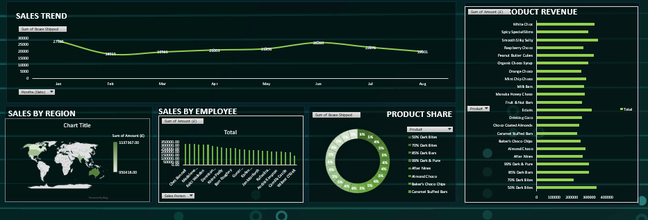

# 📊 Sales Dashboard Project

## 🖼️ Project Overview
This project showcases an **interactive Sales Performance Dashboard** that visualizes key metrics such as sales trends, product revenue, employee performance, and regional sales distribution.  
It enables quick insights into overall business performance and highlights top-performing areas and products.

---

## 🚀 Features
- **Sales Trend Analysis** – Visualizes monthly sales shipped across the year.  
- **Sales by Region** – Displays global sales distribution on an interactive world map.  
- **Sales by Employee** – Ranks employees by total sales performance.  
- **Product Revenue Breakdown** – Compares revenue generated across different products.  
- **Product Share** – Represents product contribution to total revenue via a donut chart.  

---

## 📂 Project Files
| File Name | Description |
|------------|-------------|
| `dashboard.png` | Image preview of the Sales Dashboard |
| `Chocolate Sales.xlsx` | Source dataset used to build the dashboard |

---

## 🧠 Insights Gained
- Peak sales occur around **June–July**.  
- A few employees significantly outperform others.  
- **Premium and specialty products** contribute the most to total revenue.  
- Regional data indicates stronger performance in select markets.  

---

## 🛠️ Tools & Technologies
- **Microsoft Excel / Power BI / Tableau** (depending on the build tool used)  
- **Data Source:** Internal company sales data or sample dataset  
- **Visual Elements:** Line charts, bar charts, donut charts, and world maps  

---

## 📸 Dashboard Preview

---

## 💡 How to Use
1. Clone or download this repository.  
2. Open the dashboard file (e.g., `.xlsx`, `.pbix`, or `.twbx`) in the respective tool.  
3. Interact with the visual elements and filters to explore data insights.  
4. Replace the data source with your own dataset to customize the analysis.

---

## 📜 License
This project is released under the [MIT License](LICENSE).  
Feel free to use and modify it for personal or professional projects.

---

## 🙌 Acknowledgements
Thanks to the contributors and dataset creators who made this visualization possible.  
Special thanks to the data visualization community for inspiration and best practices.

